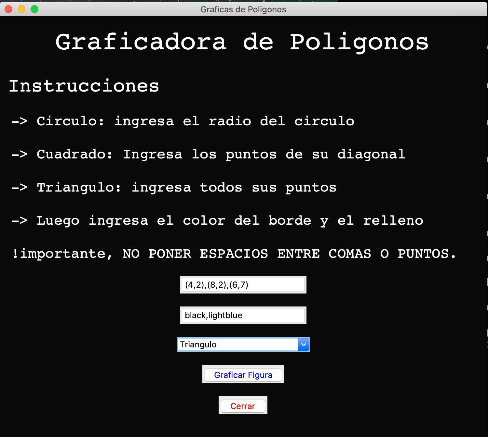
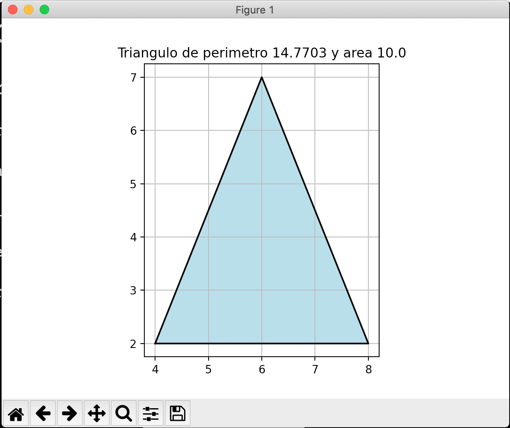

# ploting figures window

This is a window were you can insert information to **plot a figure**.

## Dependences
* **matplotlib**
* **numpy**
* **tkinter**

## The instructions:

* Select the figure you want to plot
* Then insert the numbers that are required
* Later select the border and fill color
* Finally press the 'Graficar' button to plot the figure

## This is how looks like

# Funcionalidad [Spanish]

El proyecto se **dividió en tres módulos** de forma que su arquitectura brinde una mejor organización. La funcionalidad de cada archivo o módulo es la siguiente:

## Figuras.py

De este archivo provienen las clases para cada figura, las clases de nombre `Circulo, Cuadrado y Triangulo` y las tres reciben la herencia de una clase base llamada `Figura cuyos atributos son los colores de relleno y de contorno de la figura`. Además algunas clases tienen métodos privados como los de **__punto_medio** o **__distancia**, los cuales sirven para algunos cálculos en el área o perímetro de la figura. Todas las clases de las figuras tienen cuatro métodos:

* Los de obtener **perímetro y área** del polígono, los cuales dependen de la clase en la que se encuentren ya que los procedimientos para obtener estos números dependen del polígono.
* Uno llamado **plot** que lo que hace es `retornar en una tupla todos los datos numéricos (un conjunto de puntos X,Y)` para realizar el plot y además `retorna los colores de relleno y de contorno`.
* Uno de sobrecarga **__str__** el cual lo usé para ajustar el título del plot, en el cual se contendrían el nombre del polígono así como su área y su perímetro.

Además, vale recalcar que cada clase se instancia con algunos datos diferentes, aparte de lo que vienen siendo los colores del relleno y contorno del plot, estos son los datos numéricos:
* Para el **Circulo** se requiere pasar únicamente el valor de su radio.
* Para el **Cuadrado** se requieren solamente los valores de los dos puntos de su diagonal (inclinada hacia la derecha). Es decir, solo un par de puntos.
* Para el **Triangulo** se requieren los tres puntos de sus vértices.

## plot.py
Este módulo solo contiene una función llamada **figura**, la cual se usa para plotear las figuras indicadas por el usuario. La función recibe dos parámetros, mismos que son brindados directamente por las clases de las figuras:

* data: data es el parámetro de tipo tupla o lista que `contiene las x, las y, color de contorno y color de relleno`. Este parámetro es brindado directamente por el método plot de las clases de las figuras.
* title: que como su nombre lo dice `será el título del plot`, en el que se colocarán los valores de perímetro y área en un formato adecuado. Este parámetro es directamente dado de colocar la clase de la figura como parámetro de la función.

## main.py
Es el archivo principal del proyecto, en este se construye la ventana. Lo importante de este archivo son las funciones declaradas, las cuales se activan mediante el evento de presionado del botón de “graficar”. Son las siguientes:

* read_colors(): esta función lo que hace es leer la entrada de texto de los colores, y pasa el texto a un formato de lista para que tengamos el color de relleno y contorno como los elementos de una lista.
* read_points(): esta función lo que hace es leer los puntos colocados en la entrada de texto tales que los pase a un formato de lista donde cada elemento de esta sea un punto.
* action(): esta función es la que se activa al presionar el botón. Lo que hace es primero comprobar que figura ha sido seleccionada. Después declara la clase de la figura indicada con los datos que esta requiere para finalmente usar la función de **figura()** y le pasamos los parámetros: **[clase_figura].plot() y [clase]** en los cuales vienen los datos para realizar el plot.

